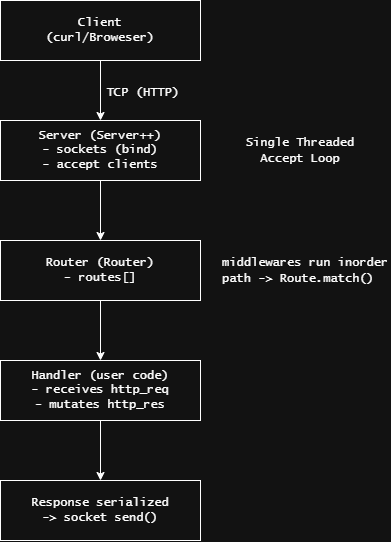
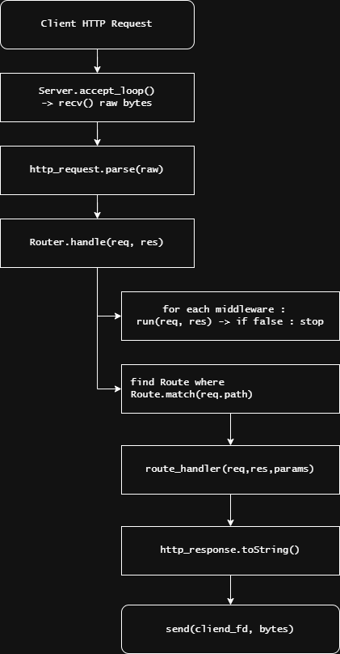

# Server++

[](https://isocpp.org/)
[](https://cmake.org/)
[](./LICENSE)
[](#)

```plaintext
=================================================================================
                    _____                                      
                   / ____|                           _     _   
                  | (___   ___ _ ____   _____ _ __ _| |_ _| |_ 
                   \___ \ / _ \ '__\ \ / / _ \ '__|_   _|_   _|                  
                   ____) |  __/ |   \ V /  __/ |    |_|   |_|  
                  |_____/ \___|_|    \_/ \___|_|               
  
=================================================================================
```

Server++ — A Minimal, demo-ready HTTP server framework written in modern C++ (C++17). Provides routing, middleware support, and a small `.env` config reader. Great for demos showing a C++ REST backend without heavy dependencies.

---

## Quick facts

- Language: **C++17**
- Build: **CMake**
- Focus: Learning / Demo / Small local services
- License: **MIT**

---

## Features

- Lightweight router with parameterized routes and wildcard support
  - `GET`, `POST`, `PUT`, `PATCH`, `DELETE`
  - Path params (e.g. `/users/:id`) and simple wildcard (`/static/*`)
- Middleware support (pre-route hooks that can short-circuit)
- Simple `http_request` / `http_response` types
- Blocking single-threaded TCP server (easy to understand/extend)
- `.env` value reader (`getValue`) for small config
- Small surface area — easy to wire into DAOs and business logic

---

## Badges & Quick Links

- C++17, CMake build
- Local build tested on Linux/macOS/Windows (WSL)
- Example endpoints included in `src/main.cpp`

---

## Files of interest

- `include/net/server.hpp` + `src/net/server.cpp` — single-file TCP server
- `include/net/router.hpp` + `src/net/router.cpp` — router + middleware
- `include/net/route.hpp` + `src/net/route.cpp` — route matching & params
- `include/net/http_types.hpp` + `src/net/http_types.cpp` — request/response
- `include/util/dot_env.hpp` + `src/util/dot_env.cpp` — `.env` reader
- `src/main.cpp` — minimal demo wiring

---

## Quick start

### Create `.env` in project root

```ini
# .env
PORT=4001
```

### Build

```bash
mkdir -p build
cmake -S . -B build
cmake --build build --target Server++
```

### Run

```bash
./build/Server++
```

### Try with curl

```bash
curl http://localhost:4001/
```

## Example usage (copy/paste)

`Note:` Example uses nlohmann/json
for convenience. Add it to your project via `find_package(nlohmann_json REQUIRED)` or a single-header copy.

```cpp
#include <iostream>

#include "net/server.hpp"
#include "util/dot_env.hpp"
#include "util/json.hpp"        // <- This can be copy pasted from neils nlohmann's json repository's single_include directory

using json = nlohmann::json;

int main() {
    // Read port from .env or use 4001
    int port = 4001;
    std::string p = getValue(".env", "PORT");
    if (!p.empty()) port = std::stoi(p);

    Server server(port);
    auto& r = server.get_router();

    // Logging middleware
    r.use(
        [] (
            const http_request& req, 
            http_response& res
        ) -> bool {
            std::cout << req.method << " " << req.path << std::endl;
            return true; 
        }
    );

    // Simple GET
    r.GET(
        "/", 
        [] (
            const http_request& req, 
            http_response& res, 
            const route_parameters& params
        ) {
            res.version = "HTTP/1.1";
            res.status_code = 200;
            res.status_txt  = "OK";
            
            res.body = "Hello from Server++";

            res.headers["Content-Type"] = "text/plain";
        }
    );

    // Echo JSON POST
    r.POST(
        "/api/data", 
        [] (
            const http_request& req, 
            http_response& res, 
            const route_parameters& params
        ) {
            json out;
            out["msg"] = "POST Received";

            try {
                out["req"] = json::parse(req.body);
            } catch (...) {
                out["req"] = nullptr;
                out["error"] = "Invalid JSON";
            }
            
            res.version = "HTTP/1.1";
            res.status_code = 201;
            res.status_txt  = "Created";
            
            res.body = out.dump(4);
            
            res.headers["Content-Type"] = "application/json";
        }
    );

    server.start();
    return 0;
}
```

## API Reference (essential)

### Server

- `Server::start()` — start accept loop, blocking
- `Server::stop()` — stops server, closes socket
- `Server::get_router()` — reference to Router to register routes & middleware

### Router

- `GET(path, handler)`, `POST(path, handler)`, `PUT`, `PATCH`, `DELETE`
- `use(middleware)` — register middleware: bool(const http_request&, http_response&)
- `handle(req, res)` — internal : run middleware + matched route

### http_request

- `method`, `path`, `version`, `headers (map)`, `body`
- `parse(raw_request_string)` method provided

### http_response

- `version`, `status_code`, `status_txt`, `headers (map)`, `body`
- `toString()` to get full wire representation

## Routes & Parameter Examples

| Route            | Example request        | params           |
| ---------------- | ---------------------- | ---------------- |
| `GET /users/:id` | `/users/42`            | `{ "id": "42" }` |
| `GET /static/*`  | `/static/css/main.css` | wildcard match   |
| `POST /api/data` | JSON body accepted     | none             |

## Architecture



## Request → Router → Handler flowchart



## License

MIT see [LICENSE](LICENSE)
